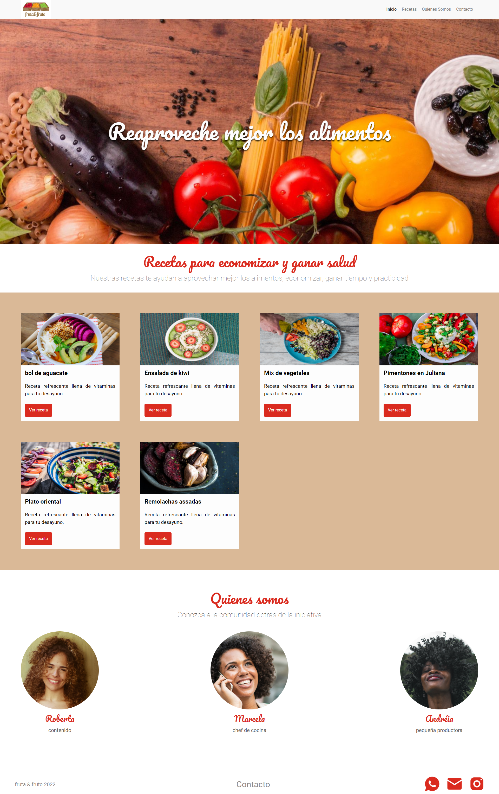

# Practica Frontend UI - Arquitectura CSS

Trabajo práctico para el aprendizaje de la arquitectura CSS mediante el desarrollo de un sitio web Fruta&Fruto

### Captura de pantalla

### Links

- URL de la solución: [Solución.](https://)

### Buenas prácticas CSS:
- Metodologia BEM Estandar nomenclatura de clases 
- Metodología ACSS (Atomic Design)
- Diseño web responsivo

## Author

- LinkedIn - [@CarlosMunera](https://www.frontendmentor.io/profile/CarlosMunera)

